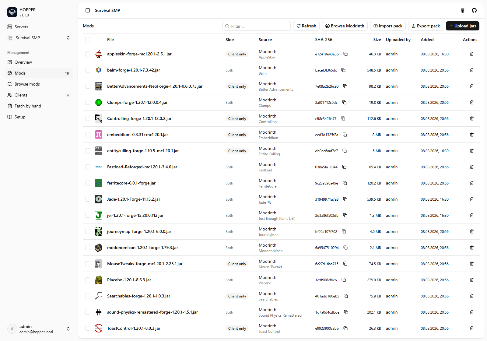
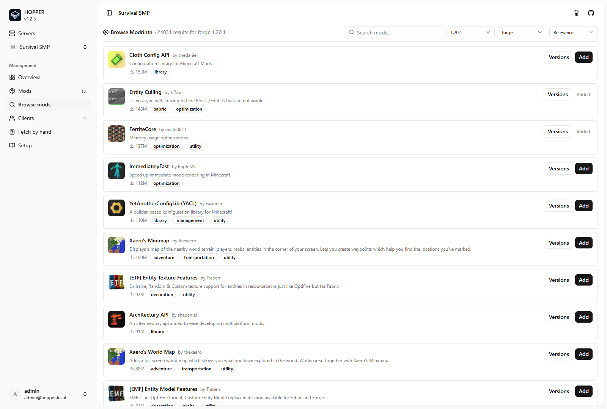
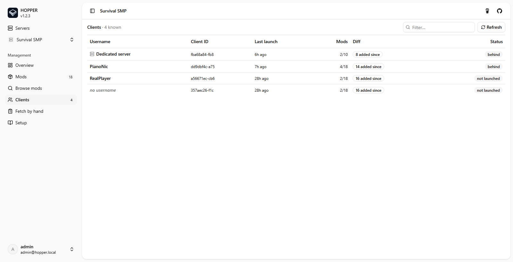
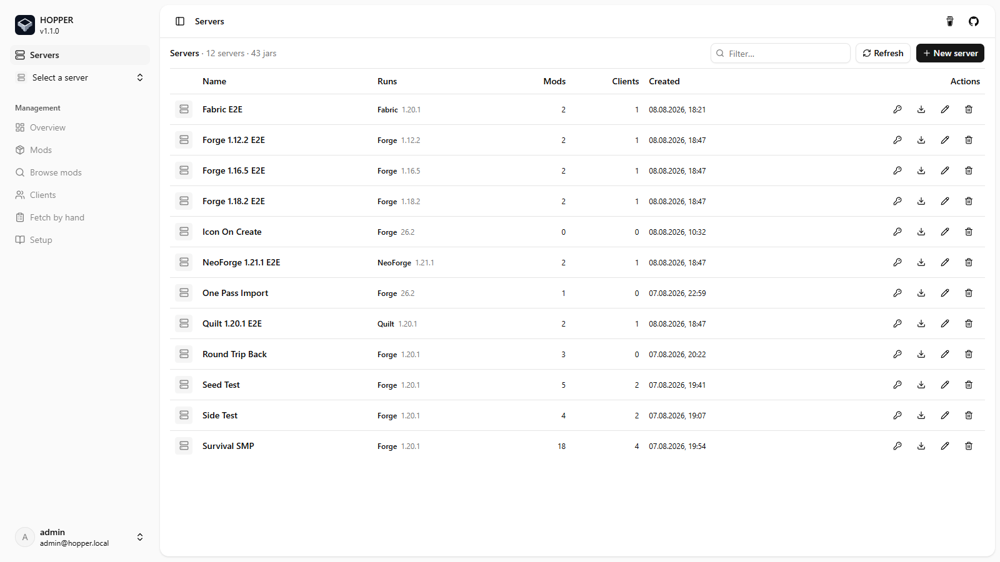
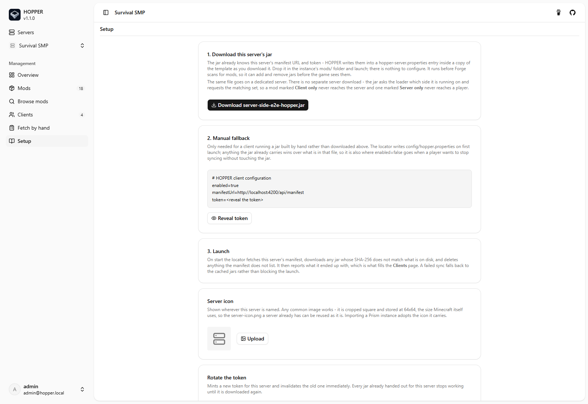
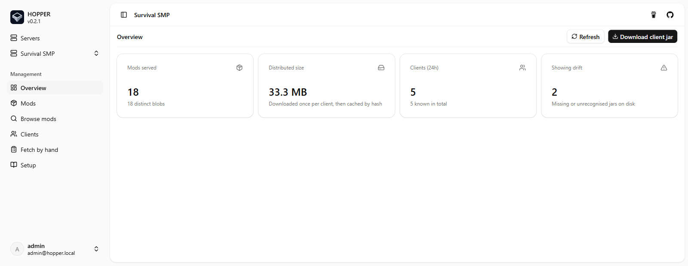

  

  <strong>HOPPER</strong> 
  One list on the server. Every client in sync, before the game starts.

  
  
  

---

> **Heads up:** HOPPER is young and self-hosted. The manifest a client reads is a fixed contract pinned by tests, so upgrading the server will not break a jar already in someone's `mods/`. Everything around it still moves - since 1.0.0 the settings table has gained four entries and lost one - so skim the release notes before you upgrade.

## What is HOPPER?

Everyone on a Minecraft server needs the same mods. Normally that means zipping a folder, posting it in Discord, and chasing the one person who missed an update.

HOPPER makes the server itself the source of truth, and each player's game pulls from it at launch. Add a mod in the dashboard and it is on every client the next time they start - no zip files, no "did you update yet?", and on Forge and NeoForge no restart either. Your friends install a single jar once, and it works under Prism, CurseForge and the vanilla launcher alike.

The same jar goes on your dedicated server, which stays in sync from the same list. Mods that belong on only one of them - a minimap on a server, a permissions plugin on a client - are marked as such and sent only where they belong.

## Screenshots

  
  

  
  

<strong>Show more screenshots</strong>

  
  

## Features

- **No restart**: on Forge and NeoForge, mods are downloaded before the loader scans for them, so they load in the same launch. See [how it works](docs/how-it-works.md).
- **A face per server**: upload an icon, or let a Prism import adopt the one it already carries. Stored at 64x64, the size Minecraft uses, so an existing `server-icon.png` works as it is.
- **Every loader generation**: Forge 1.12.2 through current, NeoForge, Fabric and Quilt, from one shared core plus a thin adapter each.
- **Launcher-agnostic**: one jar in `mods/`, no pre-launch command and no custom JVM arguments.
- **Zero client config**: the generated jar already carries its server's URL and token.
- **Leaves your own mods alone**: downloads land in `hoppermods/`, never in `mods/`. A required mod already installed by hand is moved over rather than downloaded again, and a jar HOPPER did not download is parked in `hoppermods/parked/` rather than deleted, then cleared three days later.
- **The server too**: the same jar keeps a dedicated server in sync from the same list, and marks which mods belong to which side so a client-only mod never reaches it.
- **Multiple servers**: each with its own mod list, token and jar; a client only ever sees its own.
- **Browse and import**: search Modrinth with dependency resolution, or import a Modrinth, CurseForge or Prism pack by file or URL.
- **Verified downloads**: every jar is checked against its SHA-256 before it is installed.
- **Never blocks the launch**: offline or server down, the game starts on the last good set.
- **OIDC auth**: bring your own provider or use the bundled Keycloak-compatible mock.

## Loader support

| Loader | Same launch |
| --- | --- |
| Forge 1.12.2 and older | yes |
| Forge 1.13 to 1.16.x | yes |
| Forge 1.17 and 1.18 | yes |
| Forge 1.19 and newer | yes |
| NeoForge 1.20.2+ | yes |
| Quilt | opt-in, see below |
| Fabric | no, sync then restart |

Fabric has no public hook that runs before mod discovery, so HOPPER syncs from the `preLaunch` entrypoint and tells the player a restart is needed when something changed. Quilt has the right hook but refuses to parse a plugin jar unless the player sets `-Dloader.experimental.allow_loading_plugins=true`, so a Quilt server gets the Fabric jar by default and the plugin jar only on request. [The details](docs/how-it-works.md#loader-coverage).

## Get started

- 📦 **[Self-hosting guide](docs/self-host.md)** - run the image with `docker compose`.
- 🛠️ **[Developer setup](docs/dev-setup.md)** - local dev, migrations, tests.
- 🧩 **[How it works](docs/how-it-works.md)** - the locator, the generated jar, and version coverage.
- 🔧 **[The locator build](docs/locator.md)** - one adapter per loader generation, and what each may touch.

## License

[PolyForm Noncommercial 1.0.0](LICENSE.md). Copyright PianoNic.

The whole repository: the API, the dashboard, and the Java locator that ships inside every client
jar. Read it, change it, and run it for any noncommercial purpose - your own server, your friends',
a school or a charity. Commercial use is not licensed, so selling it or hosting it as a paid service
needs a separate agreement. Source-available, not open source.

---

Made with care by <a href="https://github.com/PianoNic">PianoNic</a>

